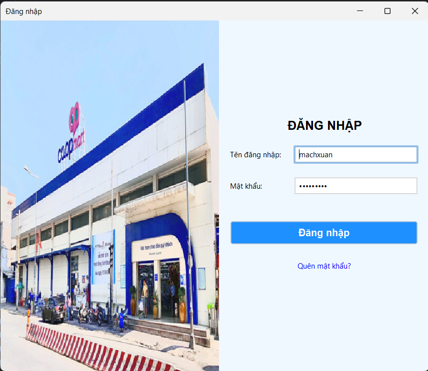
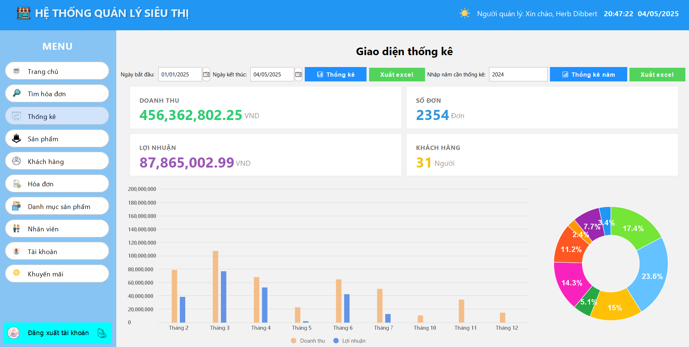
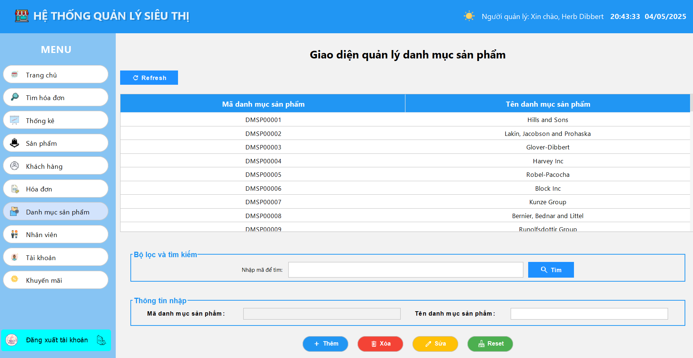
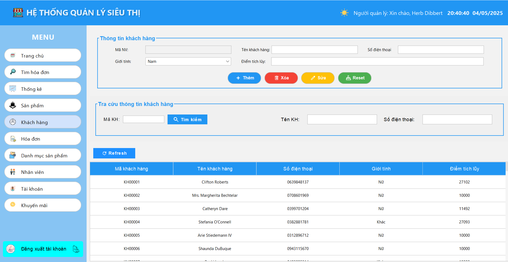
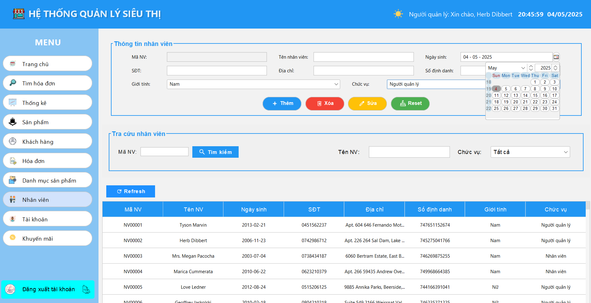
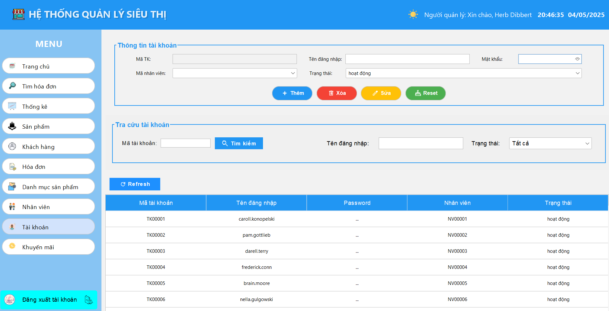
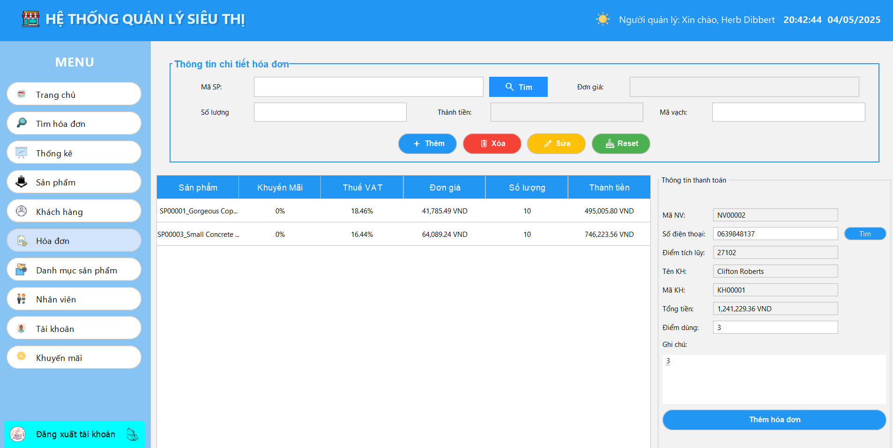
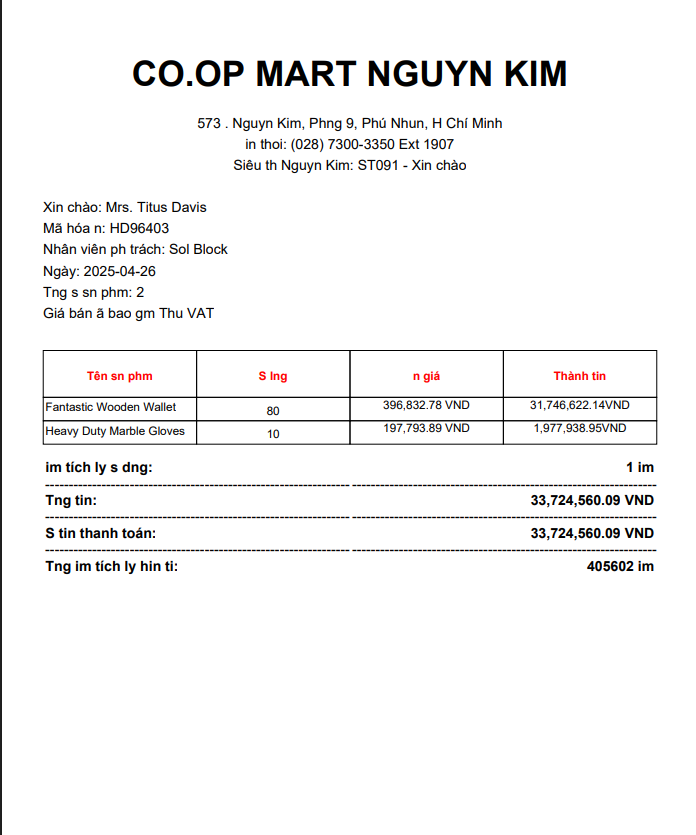
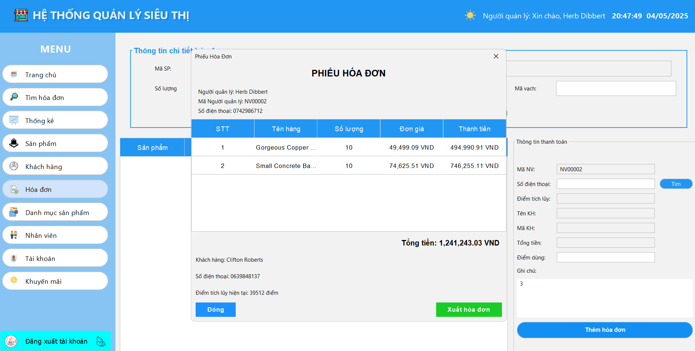

# 🛒 Hệ Thống Quản Lý Siêu Thị - Supermarket Management System

Hệ thống quản lý bán hàng siêu thị sử dụng Java RMI (đồng bộ) và Socket (bất đồng bộ) với giao diện Java Swing.

## 🖥️ Giao Diện Demo

### Màn hình đăng nhập

### Màn hình thống kê

### Màn hình quản lý sản phẩm

### Màn hình danh mục

### Màn hình khách hàng

### Màn hình nhân viên

### Màn hình tài khoản

### Màn hình bán hàng

### Màn hình xuất hóa đơn

### Màn hình thanh toán

## 🛠 Công Nghệ Sử Dụng

- **Frontend**: Java Swing
- **Backend**: Java RMI + Socket
- **Database**: MySQL
- **Build Tool**: Maven
